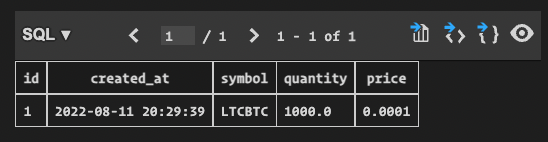
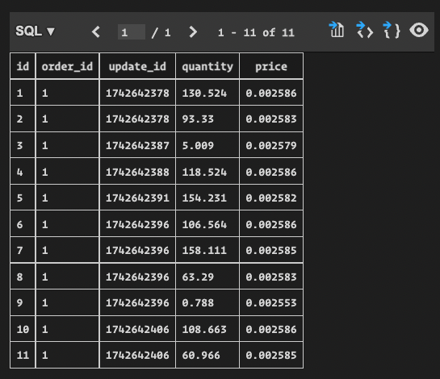

# Trade Executor Tech Challenge

Built using Go 1.18.

This repository houses a service that will "fulfill" (no actual orders placed.. for now) orders with Binance and persist the fulfilled order details to a SQLite3 database.

It exposes a single HTTP endpoint `POST /order/limit` that allows a user to consume the service. See [Using the Service](#using-the-service) for more details.

See [Summary & Future Enhancements](#summary--future-enhancements) below for answers to the questions listed at the end of the `.pdf`.

## Local development

### Getting Started

This repository makes use [Task](https://taskfile.dev/#/) and [golangci-lint](https://golangci-lint.run/).
These may be installed (on Mac) with:

```bash
brew install go-task/tap/go-task
brew install golangci-lint
brew install goenv
```

You must also have `docker-compose` installed, and the Docker daemon must be running on your machine (on Mac this can be installed by following the instructions [here](https://docs.docker.com/desktop/install/mac-install/)).

### Running the service

```bash
task run
```

### Tests

**Work In Progress**

```bash
task test
```

### Linting

```bash
task lint
```

## Using the service

```bash
$ curl --request POST \
    --url http://localhost:8080/order/limit \
    --data '{"symbol": "LTCBTC", "order_size": 1000, "price": 0.0001}'
```

In this particular case my order was fulfilled after 9.36s as such:

```json
{
  "message": "Order successfully fulfilled"
}
```

**Note**: note that the exact response you get back will be heavily dependent on several factors:

- current market
- symbol, order size, and ask price you chose

In addition, the data that was persisted to the database (stored locally as `database.db`) was as such:

`fulfilled_orders` table:



`fulfilled_order_splits` table:



## Summary & Future Enhancements

In total I spent ~5 hours on this challenge. I tackled this task by breaking it into the following main pieces:

1. having a way to an easy way, for any new developer, to run the project locally
1. the HTTP server
1. the order fulfillment logic
1. database persistence

The most obvious/first thing that I would tackle is the synchronous behavior of the current HTTP endpoint. Currently the user could wait up to a maximum of 30 seconds, this is not an ideal UX (configured with the `ORDER_TIMEOUT_SECONDS` environment variable, see `docker-compose.yml` for more details; this is the maximum amount of time the order executor will wait before considering an order "unfulfillable").

In my ideal architecture, the HTTP endpoint would simply throw the request details onto a RabbitMQ or Redis queue and the user would simply get back a very quick (<100ms) response letting them know that their order is being processed. There would be separate processes running that are consuming the events in these queues and actually processing the orders. The UI would have some sort of websocket mechanism setup to notify the user when the order fulfillment is actually finished.

In addition some other minor, but still important, details that I would change are:

- running the service on a k8s cluster. This would allow me to create `Service` and `HorizontalPodAutoscaler` resources to ensure scalability of this service
- CI/CD - making sure to run the tests and linting on each PR commit. No PRs would be allowed to merge to `main` if a build is failing.
- Integration tests - spin up the service on each CI build, and run a suite of integration tests against the fresh/local database
- monitoring - I would setup Datadog to add enough metrics to have a consistent and reliable "heartbeat" on the service. In addition there would be PagerDuty alerts configured in Datadog to immediately alert the team in the event that certain metrics are outside configured thresholds
- logging - exporting logs to a permanent solution which would make future analysis/debugging much easier (ex. Graylog)
- tracing - implementing a tool such as HoneyComb, again this is something that would make performance monitoring and debugging much simpler
- request validation - right now I'm simply assuming that the HTTP endpoint client will pass in data that isn't bogus. In a real world application this should be validated and in the event that there are any request errors, the client should be given useful information as to what exactly those errors are.

## Still todo

- [x] create an HTTP endpoint that executes an order (POST endpoint that takes a symbol, order size and price as input)
- [x] connect to the binance order book ticker stream
- [x] write order fulfillment logic
- [x] add timeout to the trade execution
- [x] write to sqlite-db: output summary on how the order was split
- [x] add comments to functions
- [ ] write unit tests
